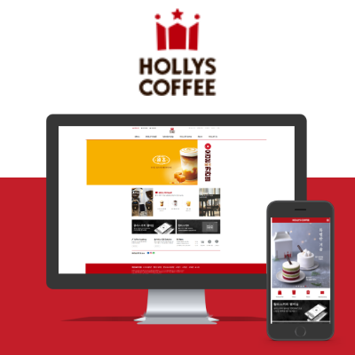

>#### 프로젝트에 사용한 모든 `카페 관련 이미지의 저작권은 할리스 커피에 있음`을 알립니다.

# 프로젝트 - `Hollys Coffee` 

## 1. 프로젝트 간단 요약

고정형 웹페이지 퍼블리싱.  
본인 기여도 : `100%`

기존 할리스 커피 웹페이지를 모방해 퍼블리싱한 첫 프로젝트. 

---

## 2. 프로젝트에 사용한 Tools

- Publishing
  - `Visual Studio Code `  

---

## 3. 프로젝트 컨셉 & 주요 목표

1. 기존 웹페이지를 그대로 모방하여 기존 사이트 `구조 분석`
2. 퍼블리싱 개념과 `웹표준 이해`
3. 고정형과 반응형 개념, 다른점 이해
